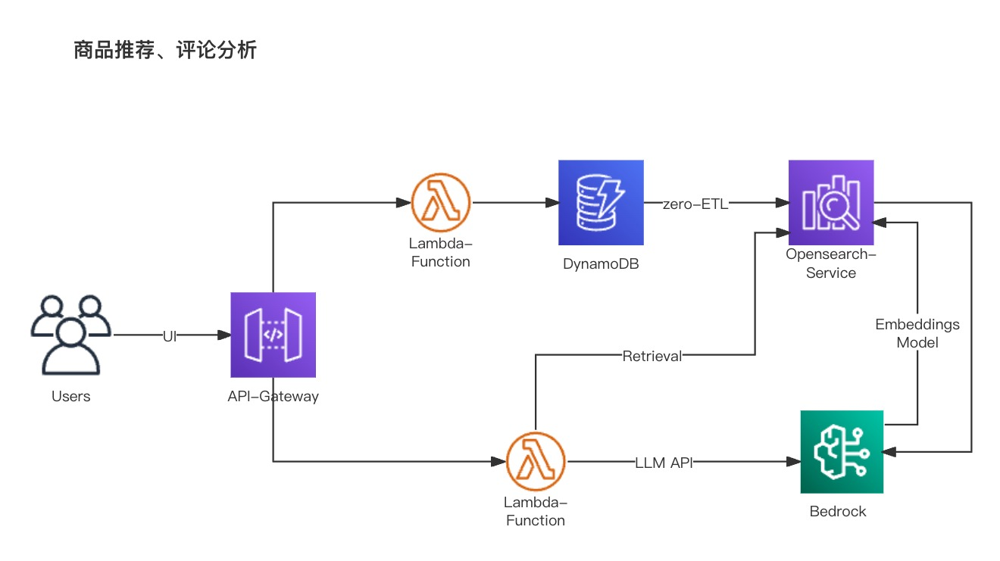
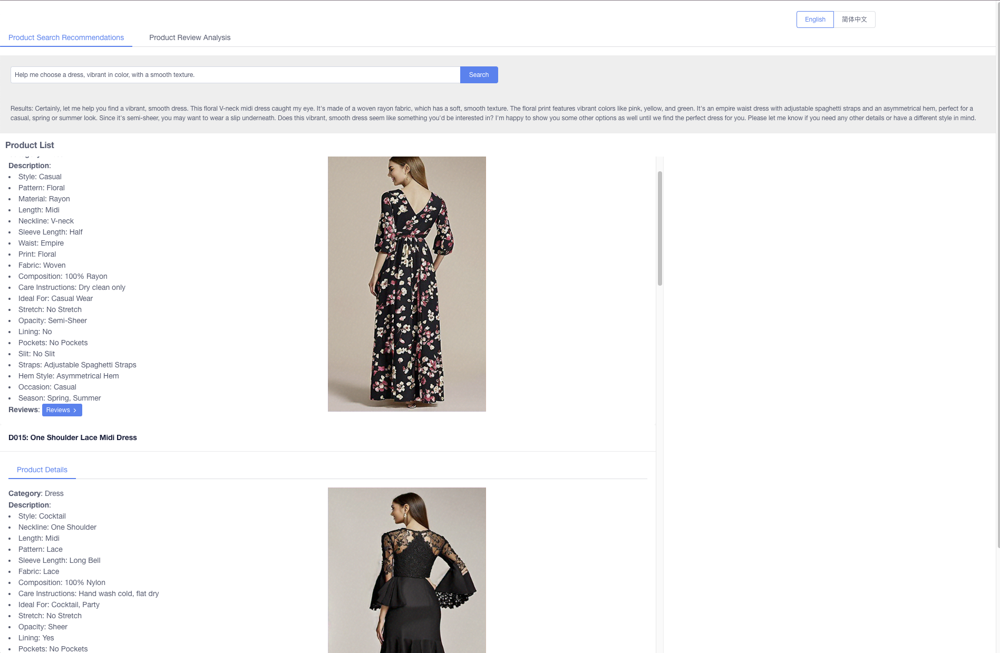
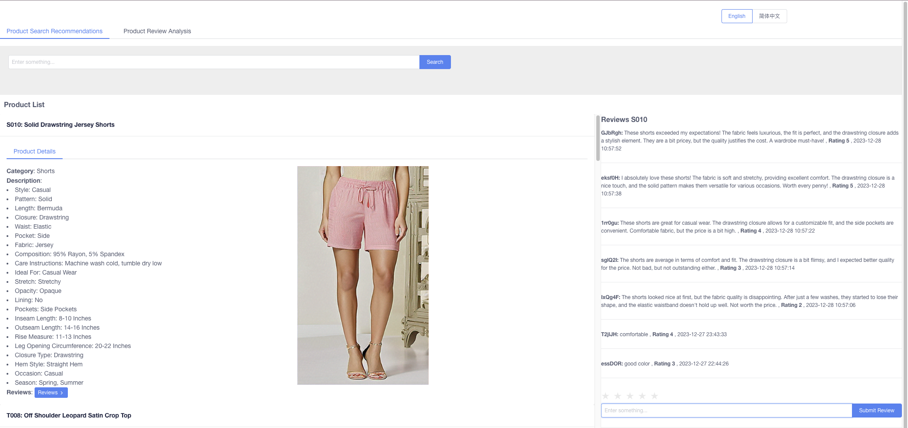
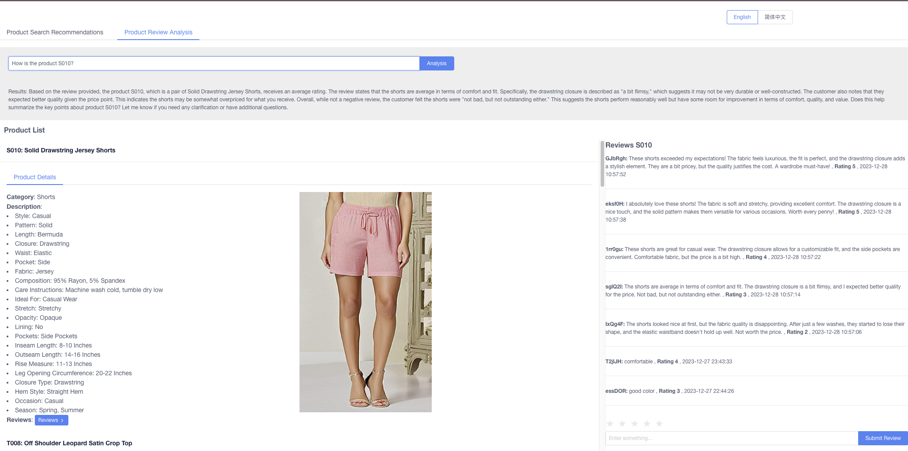

# ShopAnalytica 
This workshop on e-commerce business intelligence delves into cutting-edge technologies and advanced solutions within the e-commerce domain, aiming to showcase key techniques and methodologies in practical application scenarios. With the introduction of DynamoDB zero-ETL technology, we thoroughly explore the implementation of real-time data processing and vectorization on e-commerce platforms, aiming to elevate data processing efficiency and ensure heightened agility in operations.

The workshop not only elucidates the application of the Bedrock embedded model and LLM model within the e-commerce landscape but also demonstrates how the synergy between these models facilitates highly personalized product recommendations and sentiment analysis on customer reviews. Such intelligent analytics not only significantly enhances user experiences on e-commerce platforms but also provides businesses with profound insights, fostering data-driven decision-making.

Using DynamoDB zero-ETL for near real-time vectorization of business data, transferring it to OpenSearch. Combining Bedrock embedded model and LLM model for product recommendations and sentiment analysis on customer reviews.

电商业务智能化工作坊聚焦于电商领域的前沿技术和先进解决方案，旨在展示实际应用场景中的关键技术和方法。通过引入DynamoDB zero-ETL技术，我们深入探讨了实现电商平台实时数据处理和向量化的实践，以提高数据处理效率并确保高度敏捷性。

该工作坊不仅详细阐述了Bedrock嵌入式模型和LLM模型在电商业务中的应用，更展示了如何借助这两者的协同作用实现高度个性化的产品推荐和对客户评论的情感分析。这种智能化分析不仅显著提升用户体验，还为电商企业提供了更深刻的洞察，从而推动数据驱动的决策制定。这个工作坊为参与者提供了深度学习电商领域技术创新和分析方法的机会，使他们能够更全面地理解和应用电商智能化的最新趋势。

利用DynamoDB zero-ETL技术进行业务数据的准实时向量化，将其传输至OpenSearch。同时结合Bedrock嵌入式模型和LLM模型进行产品推荐以及对客户评论的情感分析。

AWS Workshop 公开站点 https://catalog.us-east-1.prod.workshops.aws/workshops/b223ce62-8d75-4474-a6b7-34ba77575cfc/zh-CN

## Architecture Overview （架构概览）

## Deployment Documentation（部署文档）

- [English Version](docs/en/deployment.md)
- [中文版本](docs/cn/deployment.md)

## workshop Preview

- Product Search Recommendations

- Product Reviews

- Product Review Analysis

