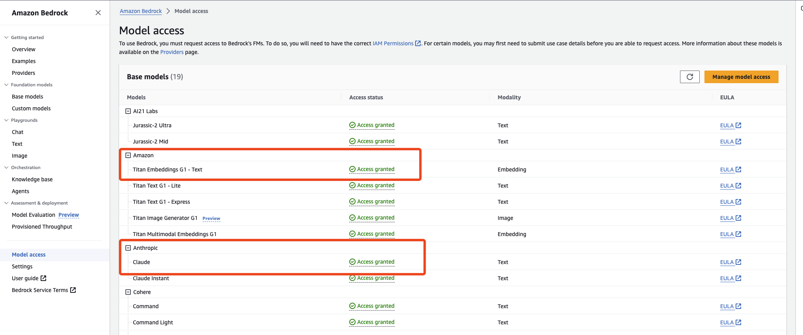
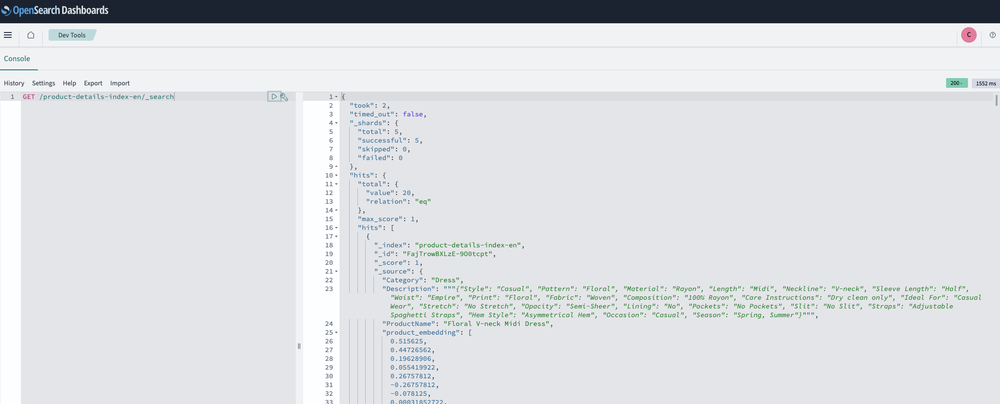
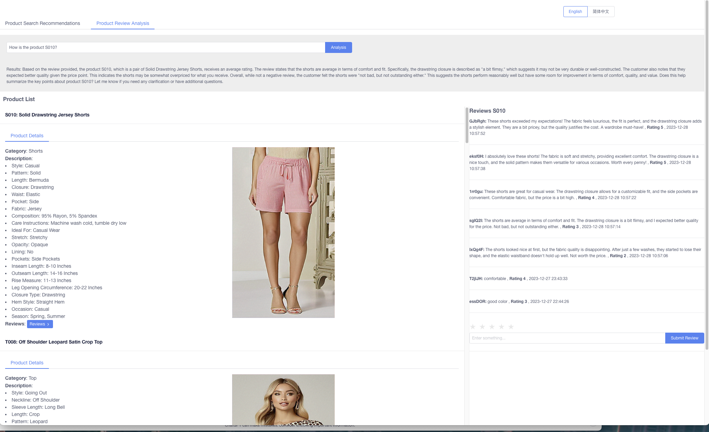

## Deployment Steps

### Environment Preparation
1. Create DynamoDB Table
```
## ProductDetails
aws dynamodb create-table \
  --table-name ProductDetails \
  --attribute-definitions AttributeName=ProductID,AttributeType=S \
  --key-schema AttributeName=ProductID,KeyType=HASH \
  --provisioned-throughput ReadCapacityUnits=5,WriteCapacityUnits=5

## ProductDetailsCN
aws dynamodb create-table \
  --table-name ProductDetailsCN \
  --attribute-definitions AttributeName=ProductID,AttributeType=S \
  --key-schema AttributeName=ProductID,KeyType=HASH \
  --provisioned-throughput ReadCapacityUnits=5,WriteCapacityUnits=5

## ProductReviews 
aws dynamodb create-table \
  --table-name ProductReviews \
  --attribute-definitions AttributeName=ProductID,AttributeType=S AttributeName=Timestamp,AttributeType=N \
  --key-schema AttributeName=ProductID,KeyType=HASH AttributeName=Timestamp,KeyType=RANGE \
  --provisioned-throughput ReadCapacityUnits=5,WriteCapacityUnits=5

## ProductReviewsCN 
aws dynamodb create-table \
  --table-name ProductReviewsCN \
  --attribute-definitions AttributeName=ProductID,AttributeType=S AttributeName=Timestamp,AttributeType=N \
  --key-schema AttributeName=ProductID,KeyType=HASH AttributeName=Timestamp,KeyType=RANGE \
  --provisioned-throughput ReadCapacityUnits=5,WriteCapacityUnits=5

```
2. Prepare OpenSearch Cluster
Create an OpenSearch cluster and configure Amazon Cognito authentication for the control panel.

- [Create an OpenSearch cluster](https://docs.aws.amazon.com/zh_cn/opensearch-service/latest/developerguide/createupdatedomains.html)
- [Configure Cognito authentication for the control panel](https://docs.aws.amazon.com/zh_cn/opensearch-service/latest/developerguide/cognito-auth.html)

3. Apply for the Bedrock model
- [Apply for the Bedrock model](https://docs.aws.amazon.com/zh_cn/bedrock/latest/userguide/model-access.html#edit-model-access)，Using Titan Emebed and Claude 2 as examples


### Basic Product Data Import
Import product information
```
## English Product Information
aws dynamodb put-item \
  --table-name ProductDetails \
  --item product_en.json

## Chinese Product Information
aws dynamodb put-item \
  --table-name ProductDetailsCN \
  --item product_cn.json
```

### Create DynamoDB to OpenSearch Zero-ETL Pipeline
1. Register OpenSearch ML model
```
# 1. Create Bedrock ml connector
POST /_plugins/_ml/connectors/_create
{
  "name": "Amazon Bedrock Connector: embedding",
  "description": "The connector to bedrock Titan embedding model",
  "version": 1,
  "protocol": "aws_sigv4",
  "parameters": {
    "region": "us-east-1",
    "service_name": "bedrock"
  },
  "credential": {
    "roleArn": "{your role  }"
  },
  "actions": [
    {
      "action_type": "predict",
      "method": "POST",
      "url": "https://bedrock-runtime.us-east-1.amazonaws.com/model/amazon.titan-embed-text-v1/invoke",
      "headers": {
        "content-type": "application/json",
        "x-amz-content-sha256": "required"
      },
      "request_body": "{ \"inputText\": \"${parameters.inputText}\" }",
      "pre_process_function": "\n    StringBuilder builder = new StringBuilder();\n    builder.append(\"\\\"\");\n    String first = params.text_docs[0];\n    builder.append(first);\n    builder.append(\"\\\"\");\n    def parameters = \"{\" +\"\\\"inputText\\\":\" + builder + \"}\";\n    return  \"{\" +\"\\\"parameters\\\":\" + parameters + \"}\";",
      "post_process_function": "\n      def name = \"sentence_embedding\";\n      def dataType = \"FLOAT32\";\n      if (params.embedding == null || params.embedding.length == 0) {\n        return params.message;\n      }\n      def shape = [params.embedding.length];\n      def json = \"{\" +\n                 \"\\\"name\\\":\\\"\" + name + \"\\\",\" +\n                 \"\\\"data_type\\\":\\\"\" + dataType + \"\\\",\" +\n                 \"\\\"shape\\\":\" + shape + \",\" +\n                 \"\\\"data\\\":\" + params.embedding +\n                 \"}\";\n      return json;\n    "
    }
  ]
}

# 2. Register Model
// Create Model Group
POST /_plugins/_ml/model_groups/_register
{
    "name": "remote_model_group",
    "description": "This is an example description"
}
// Register Model
POST /_plugins/_ml/models/_register
{
  "name": "Bedrock embedding model",
  "function_name": "remote",
  "model_group_id": "",
  "description": "embedding model",
  "connector_id": ""
}
// deploy model
POST /_plugins/_ml/models/{mode_id}/_deploy
// verify model predict
POST /_plugins/_ml/models/{mode_id}/_predict
{
  "parameters": {
    "inputText": "What is the meaning of life?"
  }
}


```
2. Create table mapping pipeline
```
# productDetails table pipeline
PUT /_ingest/pipeline/product-en-nlp-ingest-pipeline
{
  "description": "A text embedding pipeline",
  "processors": [
    {
      "script": {
        "source": """
          def combined_field = "ProductID: " + ctx.ProductID + ", Description: " + ctx.Description + ", ProductName: " + ctx.ProductName + ", Category: " + ctx.Category;
          ctx.combined_field = combined_field;
        """
      }
    },
    {
      "text_embedding": {
        "model_id": "m6jIgowBXLzE-9O0CcNs",
        "field_map": {
          "combined_field": "product_embedding"
        }
      }
    }
  ]
}

#  productDetailsCN table pipeline
PUT /_ingest/pipeline/product-cn-nlp-ingest-pipeline
{
  "description": "A text embedding pipeline",
  "processors": [
    {
      "script": {
        "source": """
          def combined_field = "商品编号: " + ctx.ProductID + ", 商品详情: " + ctx.Description + ", 商品名称: " + ctx.ProductName + ", 商品分类: " + ctx.Category;
          ctx.combined_field = combined_field;
        """
      }
    },
    {
      "text_embedding": {
        "model_id": "m6jIgowBXLzE-9O0CcNs",
        "field_map": {
          "combined_field": "product_embedding"
        }
      }
    }
  ]
}
#  productRevies table pipeline
PUT /_ingest/pipeline/product-reviews-nlp-ingest-pipeline
{
  "description": "A text embedding pipeline",
  "processors": [
    {
      "script": {
        "source": """
          def combined_field = "ProductID: " + ctx.ProductID + ", ProductName: " + ctx.ProductName + ", Comment: " + ctx.Comment + ", Timestamp: " + ctx.Timestamp;
          ctx.combined_field = combined_field;
        """
      }
    },
    {
      "text_embedding": {
        "model_id": "m6jIgowBXLzE-9O0CcNs",
        "field_map": {
          "combined_field": "product_reviews_embedding"
        }
      }
    }
  ]
}

#  productReviesCN table pipeline
PUT /_ingest/pipeline/product-cn-reviews-nlp-ingest-pipeline
{
  "description": "A text embedding pipeline",
  "processors": [
    {
      "script": {
        "source": """
          def combined_field = "商品编号: " + ctx.ProductID + ", 商品名称: " + ctx.ProductName + ", 商品评价: " + ctx.Comment + ", 时间: " + ctx.Timestamp;
          ctx.combined_field = combined_field;
        """
      }
    },
    {
      "text_embedding": {
        "model_id": "m6jIgowBXLzE-9O0CcNs",
        "field_map": {
          "combined_field": "product_reviews_embedding"
        }
      }
    }
  ]
}
```
3. Create dynamodb zero-ETL pipeline

- [dynamodb zero-ETL](https://docs.aws.amazon.com/zh_cn/opensearch-service/latest/developerguide/configure-client-ddb.html)
- Sample configuration：
```
version: "2"
dynamodb-pipeline:
  source:
    dynamodb:
      acknowledgments: true
      tables:
        # REQUIRED: Supply the DynamoDB table ARN and whether export or stream processing is needed, or both
        - table_arn: "arn:aws:dynamodb:us-east-1:837282828706:table/ProductDetails"
          # Remove the stream block if only export is needed
          stream:
            start_position: "LATEST"
          # Remove the export block if only stream is needed
          export:
            # REQUIRED for export: Specify the name of an existing S3 bucket for DynamoDB to write export data files to
            s3_bucket: ""
            # Specify the region of the S3 bucket
            s3_region: "us-east-1"
            # Optionally set the name of a prefix that DynamoDB export data files are written to in the bucket.
            s3_prefix: ""
      aws:
        # REQUIRED: Provide the role to assume that has the necessary permissions to DynamoDB, OpenSearch, and S3.
        sts_role_arn: "arn:aws:iam::837282828706:role/dynamodb-etl"
        # Provide the region to use for aws credentials
        region: "us-east-1"
  sink:
    - opensearch:
        # REQUIRED: Provide an AWS OpenSearch endpoint
        hosts:
          [
            ""
          ]
        index: "product-details-index-en"
        index_type: custom
        template_type: "index-template"
        template_content: |
          {
            "template": {
              "settings": {
                "index.knn": true,
                "default_pipeline": "product-en-nlp-ingest-pipeline"
              },
              "mappings": {
                "properties": {
                  "ProductID": {
                    "type": "keyword"
                  },
                  "ProductName": {
                    "type": "text"
                  },
                  "Category": {
                    "type": "text"
                  },
                  "Description": {
                     "type": "text"
                  },
                  "Image": {
                     "type": "text"
                  },
                  "combined_field": {
                    "type": "text"
                  },
                  "product_embedding": {
                    "type": "knn_vector",
                    "dimension": 1536,
                    "method": {
                      "engine": "nmslib",
                      "name": "hnsw",
                      "space_type": "l2"
                    }
                  }
                }
              }
            }
          }
        aws:
          # REQUIRED: Provide a Role ARN with access to the domain. This role should have a trust relationship with osis-pipelines.amazonaws.com
          sts_role_arn: ""
          # Provide the region of the domain.
          region: "us-east-1"
          # Enable the 'serverless' flag if the sink is an Amazon OpenSearch Serverless collection
          # serverless: true
          # serverless_options:
          # Specify a name here to create or update network policy for the serverless collection
          # network_policy_name: "network-policy-name"
          # Enable the S3 DLQ to capture any failed requests in an S3 bucket. This is recommended as a best practice for all pipelines.
          # dlq:
          # s3:
          # Provide an S3 bucket
          # bucket: "your-dlq-bucket-name"
          # Provide a key path prefix for the failed requests
          # key_path_prefix: "dynamodb-pipeline/dlq"
          # Provide the region of the bucket.
          # region: "us-east-1"
          # Provide a Role ARN with access to the bucket. This role should have a trust relationship with osis-pipelines.amazonaws.com
          # sts_role_arn: "arn:aws:iam::123456789012:role/Example-Role"

```
4. verify data inject


### Deploy Lambda and API Gateway
1. Deploy Lambda Functions
Create Lambda functions by copying and deploying the code from *lambda_handler_bedrock.py* and *lambda_handler_product.py*.
2. Deploy API Gateway
- Proxy POST requests to *lambda_handler_bedrock.py*.
- Proxy GET and POST requests to *lambda_handler_product.py*.

### Deploy Frontend UI
1. Download the frontend code from the 'front' directory. In the 'front/src/APP.vue' file, modify line 192 by replacing the URL with the API Gateway URL: *const APIURL = ''*.
2. Install dependencies and compile the code.
- Run locally:
```
npm install
npm run serve
```
- Compile:
```
npm install
npm run build
```
3. Verify the Frontend UI

